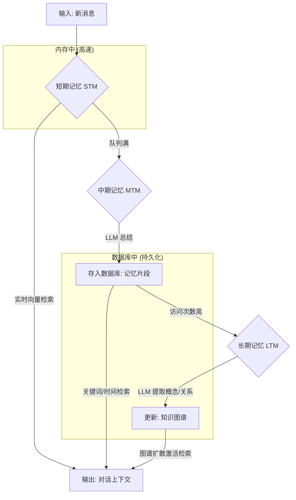

# 全新三层记忆系统架构 (V2.0) 设计文档

## 1. 核心思想

本架构旨在建立一个清晰、有序的信息处理流水线，模拟人类记忆从瞬时感知到长期知识沉淀的过程。信息将经历**短期记忆 (STM)**、**中期记忆 (MTM)** 和 **长期记忆 (LTM)** 三个阶段，实现从海量、零散到结构化、深刻的转化。

## 2. 架构分层详解

### 2.1. 短期记忆 (STM - Short-Term Memory) - “消息缓冲区”

*   **职责**: 捕获并暂存所有进入核心的最新消息，为即时对话提供上下文，实现快速响应。
*   **实现方式**:
    *   **内存队列**: 采用定长的内存队列（如 `collections.deque`），存储最近的 N 条原始消息（建议初始值为 200）。
    *   **实时向量化**: 消息入队时，异步进行文本内容的语义向量化，生成“意义指纹”。
    *   **快速检索**: 利用高效的向量相似度计算库（如 FAISS, Annoy），在新消息到来时，快速从队列中检索最相关的历史消息，构建即时上下文。
*   **触发机制**: 当队列达到容量上限时，将最老的一批消息（例如前 50 条）打包，移交给中期记忆模块处理。

### 2.2. 中期记忆 (MTM - Mid-Term Memory) - “记忆压缩器”

*   **职责**: 对来自短期记忆的大量零散信息进行压缩、总结，形成结构化的“记忆片段”。
*   **实现方式**:
    *   **LLM 总结**: 调用大语言模型（LLM）对 STM 移交的消息包进行深度分析和总结，提炼成一段精简的“记忆陈述”（Memory Statement）。
    *   **信息结构化**: 每个记忆片段都将包含以下元数据：
        *   `memory_text`: 记忆陈述本身。
        *   `keywords`: 关联的关键词列表。
        *   `time_range`: 记忆所涉及的时间范围。
        *   `importance_score`: LLM 评估的重要性评分。
        *   `access_count`: 访问计数器，初始为 0。
    *   **持久化存储**: 将结构化的记忆片段存储在数据库中，可复用或改造现有 `Memory` 表。
*   **触发机制**: 由 STM 的队列溢出事件触发。

### 2.3. 长期记忆 (LTM - Long-Term Memory) - “知识图谱”

*   **职责**: 将经过验证的、具有高价值的中期记忆，内化为系统核心知识的一部分，构建深层联系。
*   **实现方式**:
    *   **晋升机制**: 通过一个定期的“记忆整理”任务，扫描中期记忆数据库。当某个记忆片段的 `access_count` 达到预设阈值（例如 10 次），则触发晋升。
    *   **融入图谱**: 晋升的记忆片段将被送往 `Hippocampus` 模块。`Hippocampus` 将不再直接处理原始聊天记录，而是处理这些高质量、经过预处理的记忆片段。它会从中提取核心概念（节点）和它们之间的关系（边），然后将这些信息融入并更新现有的知识图谱。
*   **触发机制**: 由定时任务（例如每天执行一次）触发。

## 3. 信息处理流程

## 4. 现有模块改造计划

*   **`InstantMemory`**: 将被新的 **STM** 和 **MTM** 模块取代。其原有的“判断是否需要记忆”和“总结”的功能，将融入到 MTM 的处理流程中。
*   **`Hippocampus`**: 将保留其作为 **LTM** 的核心地位，但其输入源将从“随机抽样的历史聊天记录”变更为“从 MTM 晋升的高价值记忆片段”。这将极大提升其构建知识图谱的效率和质量。