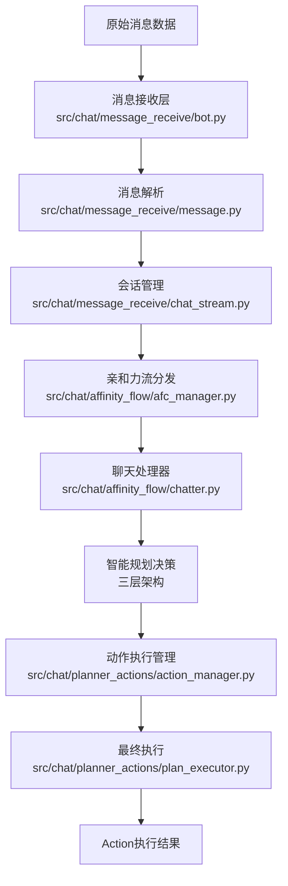
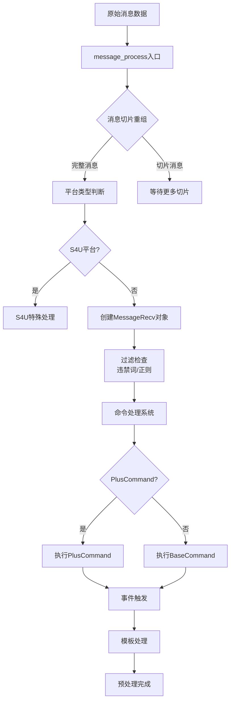
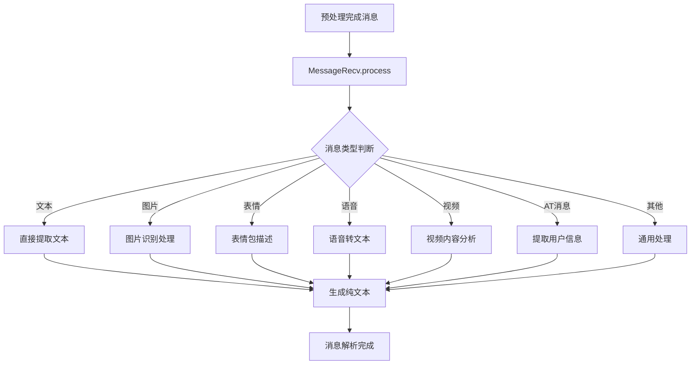
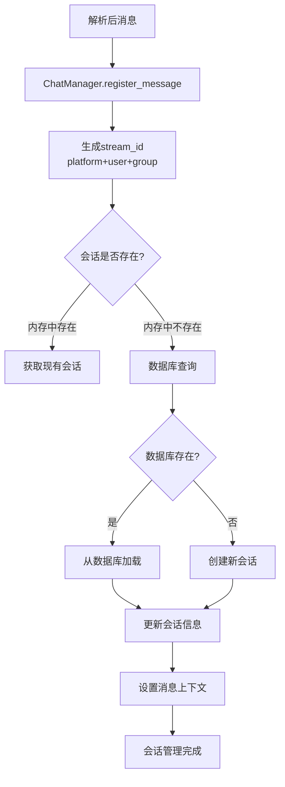
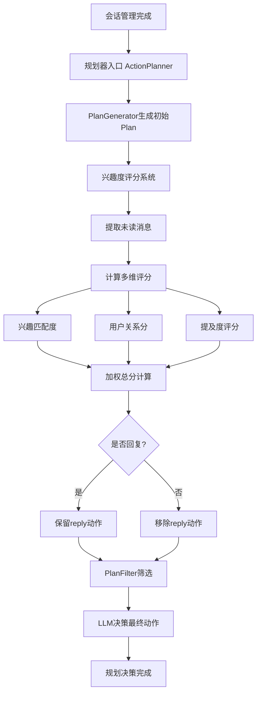
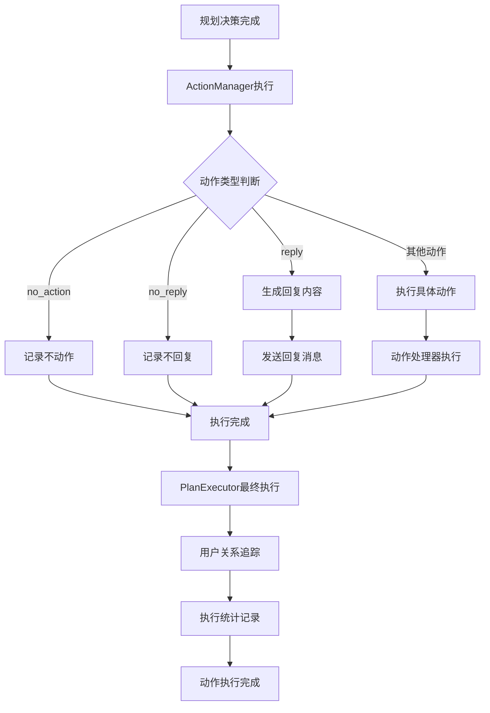
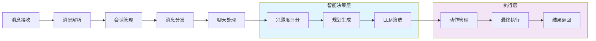
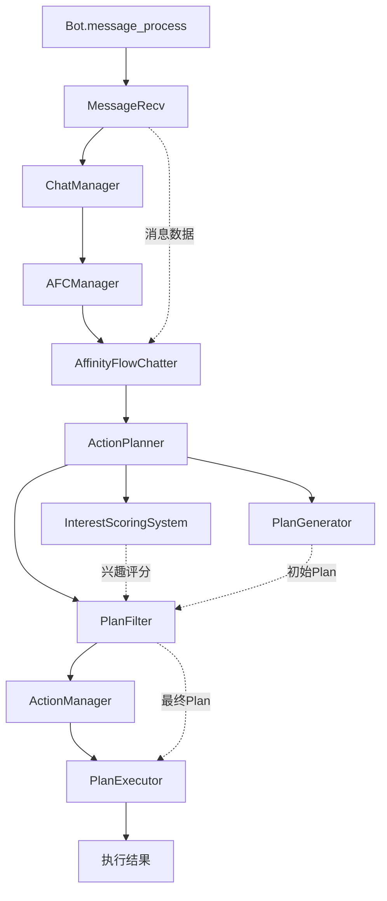
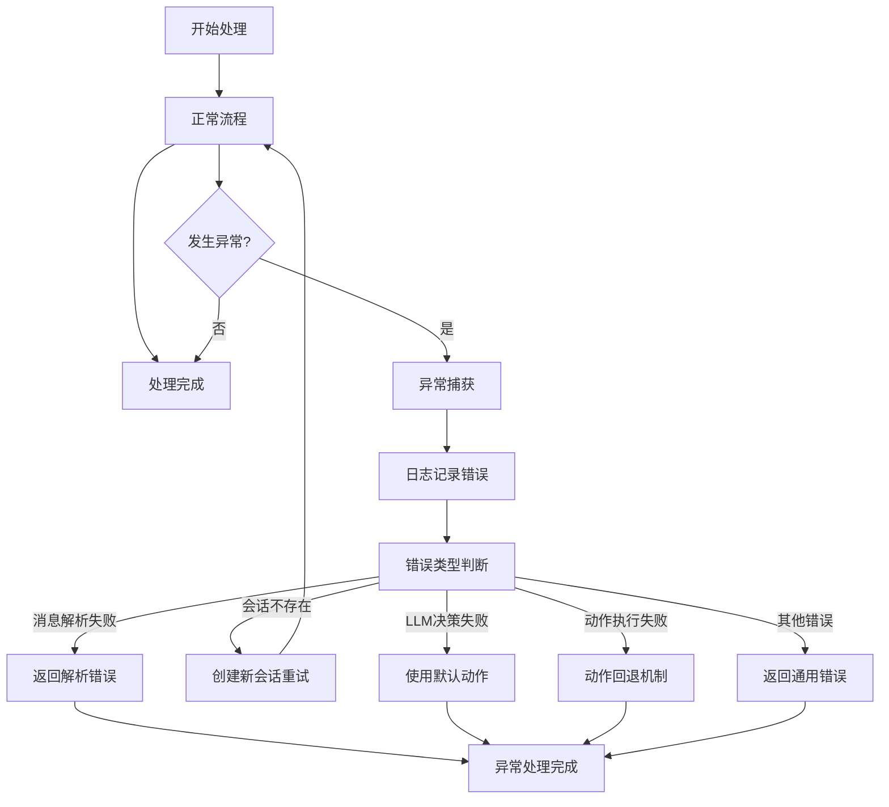

# 从消息接收到执行Action的完整流程图

## 整体流程概览

## 详细分阶段流程图

### 1. 消息接收与预处理阶段

### 2. 消息解析阶段

### 3. 会话管理阶段

### 4. 智能规划决策阶段（三层架构）

### 5. 动作执行阶段

## 完整端到端流程

## 关键组件交互关系

## 异常处理流程

这个流程图详细展示了从消息接收到执行action的完整流程，包括各个阶段的处理逻辑、组件交互关系以及异常处理机制。整个系统采用了模块化设计，具有清晰的职责分离和良好的可扩展性。